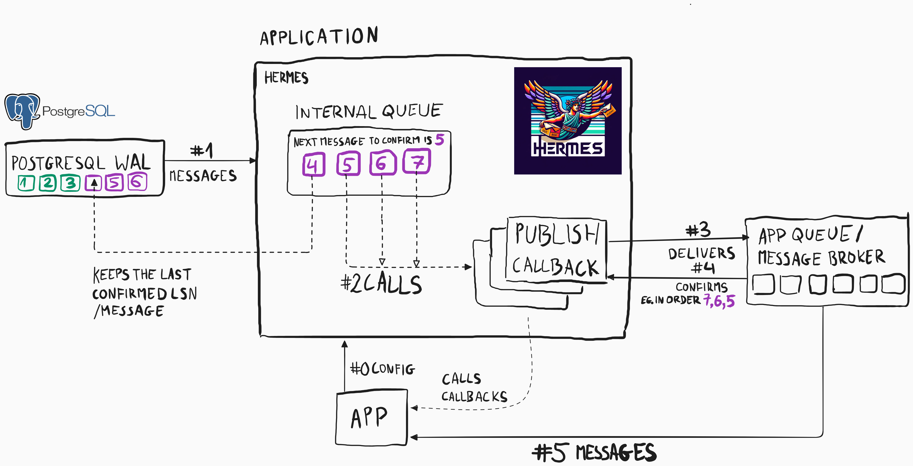
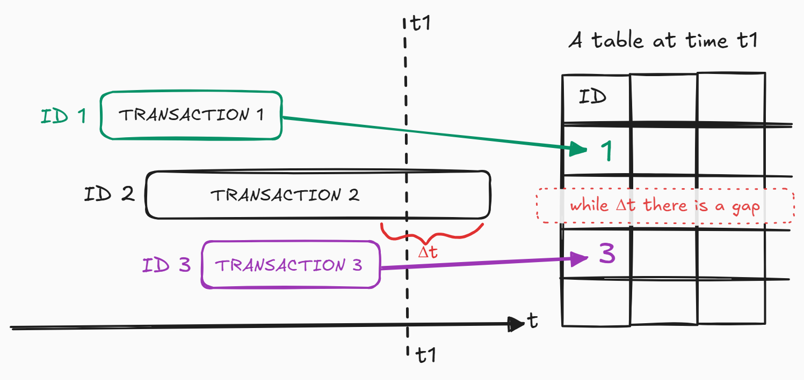
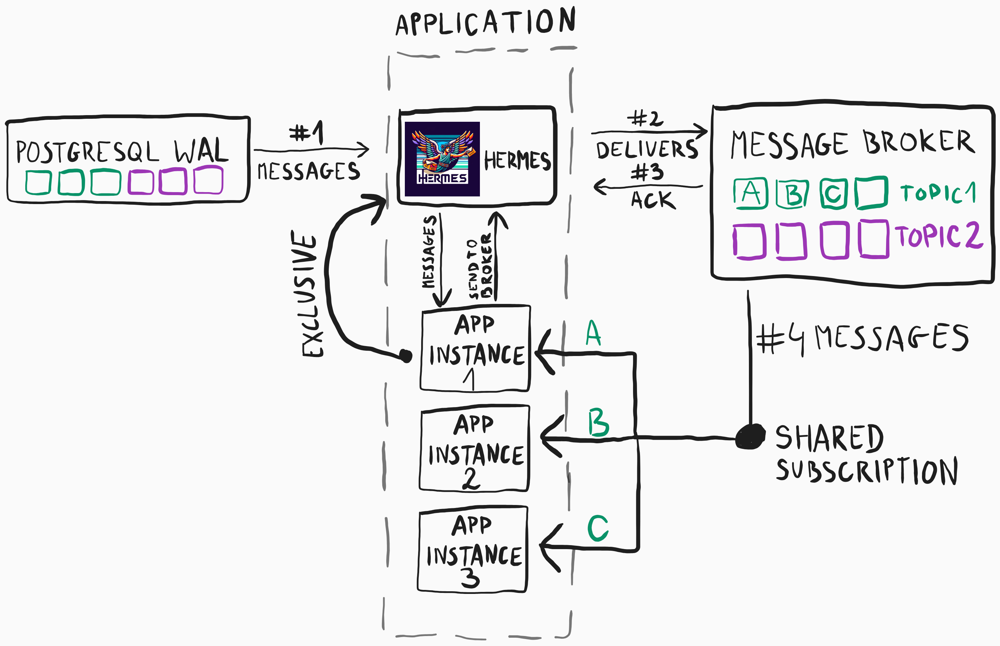

# Change Log

# [1.0.0-alpha.8](https://github.com/arturwojnar/hermes/compare/@arturwojnar/hermes-postgresql@1.0.0-alpha.7...@arturwojnar/hermes-postgresql@1.0.0-alpha.8) (2025-02-24)

First release of the Hermes PostgreSQL! 😍 🎉

_A mythical god who brings the realiability to your system_ 🫒 _by implementing the Outbox pattern, so you don't have to think of it too much._

_You don't have to pray for that gifts of nature, just run **npm** and type:_

```bash
npm i hermes hermes-postgresql
```

If you look for a full example, then [here you go](https://github.com/arturwojnar/hermes/blob/main/examples/postgresql/patient-registration/index.ts)! 🎉🎉🎉

### Features

- **_Hermes PostgreSQL_ relies on the thin and fast [Postgres.js](https://github.com/porsager/postgres)**

- **Hermes PostgreSQL creates a subscription to PostgreSQL Replication Stream (WAL)**



As you can see, _Hermes PostgreSQL_ relies on the WAL (_Write-Ahead Log_) of the database cluster exposed by the _PostgreSQL Logical Replication_ [protocol](https://www.postgresql.org/docs/current/logical-replication.html). Thanks to that, it's fast and reliable; you won't lose any message as it can happen in a classical Outbox implementation.

By default, _Hermes PostgreSQL_ calls a _publish callback_ immediately when a message appears in the _PostgreSQL Logical Replication_ stream. It happens in order of commits.

This means that if messages of numbers 5, 6, and 7 were committed more or less at the same time, then - depending on the callback processing time - they could be processed simultaneously. But _Hermes PostgreSQL_ acknowledges messages to _PostgreSQL Logical Replication_ in order. So, even though the seventh message finished processing first, before the fifth, an acknowledgement will be done only when the fifth is completed successfully.

If the app goes down before the acknowledgment of the fifth message, then after the restart all messages, that is 5, 6 and 7 will be called to be processed again.

Remember, that is what is called _at-least-once delivery_ guarantee 🥰

Check an example how to use the _PostgreSQL Logical Replication_:

```typescript
import { DeepReadonly } from 'ts-essentials'
import { addDisposeOnSigterm, type Flavour } from '@arturwojnar/hermes'
import { type HermesMessageEnvelope, type MessageEnvelope, createOutboxConsumer } from '@arturwojnar/hermes-postgresql'

/* Types definition */
type DomainEvent<
  EventType extends string = string,
  EventData extends Record<string, unknown> = Record<string, unknown>,
> = Flavour<
  DeepReadonly<{
    type: EventType
    data: EventData
  }>,
  'DomainEvent'
>
type PatientRegisteredSuccessfully = DomainEvent<
  'PatientRegisteredSuccessfully',
  {
    patientId: PatientId
    patientSub: Subject
  }
>
type PatientRegistrationFailed = DomainEvent<
  'PatientRegisteredSuccessfully',
  {
    email: Email
  }
>
type RegisterPatientEvent = PatientRegisteredSuccessfully | PatientRegistrationFailed

/* Initialization */
const publishOne = async (envelope: HermesMessageEnvelope<RegisterPatientEvent>) => {
  const { message, messageId, redeliveryCount } = envelope

  // Handling the message...
}
const outbox = createOutboxConsumer<RegisterPatientEvent>({
  getOptions() {
    return {
      host: 'localhost',
      port: 5434,
      database: 'hermes',
      user: 'hermes',
      password: 'hermes',
    }
  },
  publish: async (message) => {
    // if this function passes, then the message will be acknowledged;
    // otherwise, in case of an error the message won't be acknowledged.
    if (Array.isArray(message)) {
      for (const nextMessage of message) {
        await publishOne(nextMessage)
      }
    } else {
      await publishOne(message)
    }
  },
  consumerName: 'app',
})

/* How to run the Hermes PostgreSQL */
const stopOutbox = await outbox.start()
addDisposeOnSigterm(stopOutbox)

/* How to use the Hermes PostgreSQL */
const patientRegisterdEvent: MessageEnvelope<PatientRegisteredSuccessfully> = {
  message: {
    type: 'PatientRegisteredSuccessfully',
    data: { patientId: data.systemId, patientSub: data.sub },
  },
  messageId: constructMessageId('PatientRegisteredSuccessfully', data.sub),
  messageType: 'PatientRegisteredSuccessfully',
}

// One transaction that wraps two I/O-distinct operations.
// Now, you are sure that the `PatientRegisteredSuccessfully` will be published at-least-once.
await sql.begin(async (sql) => {
  await storePatient(data.systemId, data.sub, sql)
  // We pass the transaction to the `queue`.
  await outbox.queue(patientRegisterdEvent, { tx: sql })
})
```

- **It is based on a stream, not the pulling. So, it is less I/O operations**

- **You won't lose any message like it can happen in the classic implementation**

The classic implementation is based on a periodic pull. While doing so, it can happen that we will lose a message, which commiting takes longer than others.

It's the case because **the autoincrement identifiers are establish before starting a transaction**.



- **You can make Hermes PostgreSQL to call only one _publish callback_ at once, the rest will wait for it to be called**

```typescript
const outbox = createOutboxConsumer<RegisterPatientEvent>({
  // ...rest the same as before
  serialization: true,
})
```

- **You can't start two consumers (Hermes PostgreSQL instances) of the same name. It will throw an _HermesConsumerAlreadyTakenError_**

- **You can run two consumers of the same name but with a different _partition key_**

```typescript
const outbox = createOutboxConsumer<RegisterPatientEvent>({
  // ...rest the same as before
  partitionKey: `partition-for-tenant-XYZ`,
})
```

This is the way you can scale _Hermes PostgreSQL_ horizontally.

- **You can use _Hermes PostgreSQL_ without a _message broker_,**

then, the delivering and processing a message is a part of the same operation and can be confirmed only when the message's handler finishes successfully.

If you'd like to perform, e.g. a _compensation_, then you can use a special _Hermes PostgreSQL_ feature - _asynchronous outbox consumer_. This is a separate stack of messages which execution and delivering time doesn't matter. It has to happen at one time.

That's so that we don't occupy _PostgreSQL WAL_ when it's not needed.

```typescript
import { useBasicAsyncOutboxConsumerPolicy } from '@arturwojnar/hermes-postgresql'

const outbox = createOutboxConsumer<RegisterPatientEvent>({
  // ...rest the same as before
  asyncOutbox: useBasicAsyncOutboxConsumerPolicy(),
})

const revertRegistration = async (params: _RevertPatientRegistration['data'], email: Email) => {
  const revertCommand = literalObject<MessageEnvelope<_RevertPatientRegistration>>({
    message: {
      type: '_RevertPatientRegistration',
      data: params,
    },
    messageId: constructMessageId('_RevertPatientRegistration', params.sub.toString()),
    messageType: '_RevertPatientRegistration',
  })

  // `send`, in contrast to the `queue`, puts a message in the asynchronous stack.
  await outbox.send(revertCommand)
}
```

- **Run multiple instances of your app and distribute the messages to them**

_Hermes PostgreSQL_ keeps one instance of your app exclusively and all messages from _Logical Replication_ go to that instance.

If you want to run multiple instances of the app, you'd probably also wish to distribute messages evenly evenly. If so, you must utilize a message broker's feature to create a _shared subscription_.


